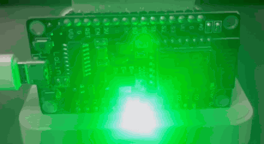
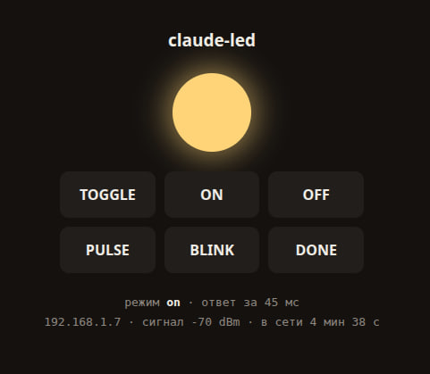

# claude-ready-led

Une LED branchée sur un ESP8266 qui **s'éteint quand Claude Code se met au travail** et
**s'allume quand il a fini**. Avec, en prime, un raccourci `Ctrl+T` valable dans tout le
système pour la basculer à la main.

[English](../README.md) ·
[Русский](README.ru.md) ·
[简体中文](README.zh-CN.md) ·
[Español](README.es.md) ·
[हिन्दी](README.hi.md) ·
[العربية](README.ar.md) ·
[Português](README.pt-BR.md) ·
**Français** ·
[Deutsch](README.de.md) ·
[日本語](README.ja.md) ·
[한국어](README.ko.md)

<p align="center">
  
  
</p>

Matériel : NodeMCU v3 (ESP8266) et n'importe quelle LED. Logiciel : un firmware avec
serveur HTTP intégré, des hooks Claude Code et un raccourci global XFCE.

---

## Installer le hook

```bash
curl -fsSL https://raw.githubusercontent.com/makhnanov/claude-ready-led/main/scripts/install.sh | bash
```

Clone le dépôt dans `~/.claude-ready-led`, écrit les hooks dans
`~/.claude/settings.json` (avec une sauvegarde dans `settings.json.bak`), enregistre
l'adresse de l'appareil dans `~/.claude-led.conf` et vérifie que la carte répond. On
peut le relancer sans risque : il remplace ses propres entrées et ne touche pas aux
autres hooks.

Si le nom mDNS ne se résout pas, passez l'adresse explicitement :

```bash
curl -fsSL https://raw.githubusercontent.com/makhnanov/claude-ready-led/main/scripts/install.sh \
  | CLAUDE_LED_URL=http://192.168.1.7 bash
```

Ensuite, ouvrez `/hooks` dans Claude Code (cela recharge la configuration) ou
redémarrez-le.

---

## Câblage

`D6`, c'est `GPIO12`.

```
D6 ──[ 220–330 Ω ]──▶| LED ──── GND
                   anode  cathode
                (patte longue) (patte courte,
                                méplat sur le rebord)
```

La résistance est obligatoire : une broche d'ESP8266 débite 12 mA au grand maximum.

---

## Firmware

```bash
cp firmware/claude_led/secrets.h.example firmware/claude_led/secrets.h
$EDITOR firmware/claude_led/secrets.h          # SSID et mot de passe, 2,4 GHz uniquement

arduino-cli core install esp8266:esp8266
arduino-cli compile --fqbn esp8266:esp8266:nodemcuv2 --upload -p /dev/ttyUSB0 firmware/claude_led
```

`secrets.h` figure dans `.gitignore`, votre mot de passe Wi-Fi n'atteint donc jamais le
dépôt. Seul `secrets.h.example`, rempli de valeurs fictives, est suivi par git.

Pour connaître l'IP attribuée :

```bash
arduino-cli monitor -p /dev/ttyUSB0 -c baudrate=115200   # la carte affiche son IP au démarrage
ping claude-led.local                                    # ou via mDNS
```

---

## API HTTP

| Requête | Effet |
|---|---|
| `GET /on` | lumière fixe |
| `GET /off` | éteindre |
| `GET /toggle` | bascule : éteinte → allumer, tout autre état → éteindre |
| `GET /pulse` | respiration douce — Claude travaille |
| `GET /blink?times=3&ms=200` | clignotement |
| `GET /done` | 3 clignotements rapides puis reste allumée — travail terminé |
| `GET /status` | JSON : mode, IP, RSSI, temps de fonctionnement |
| `GET /` | interface web (voir plus bas) |

Si `API_TOKEN` est défini dans `secrets.h`, chaque requête doit porter `?token=...`.

## CLI

```bash
scripts/led.sh on | off | toggle | pulse | done | blink 5 100 | status
```

L'adresse provient de `CLAUDE_LED_URL`, puis de `~/.claude-led.conf`, et enfin de
`http://claude-led.local`. Le script sort toujours avec le code 0 et ne bloque jamais
plus de 2 secondes : c'est ce qui permet de l'accrocher à un hook sans danger. Une
carte débranchée ou injoignable ne ralentira ni ne cassera Claude Code.

---

## Interface web

Ouvrez `http://claude-led.local/` dans un navigateur — depuis l'ordinateur ou le
téléphone, puisque mDNS fonctionne sur tout le réseau local. La carte sert une page
avec les boutons TOGGLE / ON / OFF / PULSE / BLINK / DONE, une « ampoule » qui reflète
le mode courant et un état en direct : IP, force du signal, temps de fonctionnement.

**Les boutons ne rechargent pas la page.** Un clic envoie `fetch("/on")`, la réponse
JSON revient et redessine aussitôt l'état et l'ampoule. En plus, la page interroge
`/status` toutes les 2 secondes : si la LED est changée par un hook Claude Code ou
depuis un téléphone, l'onglet le voit. L'interrogation s'arrête tant que l'onglet est
masqué (`document.hidden`), pour ne pas solliciter la carte inutilement.

Si la connexion tombe, l'ampoule devient rouge et « pas de connexion avec la carte »
s'affiche : la page ne reste jamais figée en silence.

### Où se trouve le code de la page

Il n'y a pas de fichier séparé : la carte n'a pas de système de fichiers. Toute la page
est une seule chaîne C++ dans `firmware/claude_led/claude_led.ino` :

```cpp
static const char PAGE_HTML[] PROGMEM = R"HTML(<!doctype html> ... )HTML";

void handleRoot() {
  server.send_P(200, PSTR("text/html; charset=utf-8"), PAGE_HTML);
}
```

`PROGMEM` la place en flash à côté du code et `send_P` l'envoie directement de là, sans
la copier en RAM. C'est précisément pour cela que l'état est récupéré séparément via
`/status` au lieu d'être interpolé dans le HTML : la page reste statique et n'a besoin
d'aucune RAM pour être assemblée. Ce changement a libéré environ 650 octets sur 80 Ko —
une quantité qui compte sur un microcontrôleur.

Si `API_TOKEN` est défini dans `secrets.h`, ouvrez la page ainsi :
`http://claude-led.local/?token=xxxx` — elle récupère le jeton dans la barre d'adresse
et l'ajoute à toutes ses propres requêtes.

---

## Hooks Claude Code

Ce que `install.sh` ajoute à `~/.claude/settings.json` :

```json
"hooks": {
  "UserPromptSubmit": [{ "hooks": [{ "type": "command",
    "command": "/path/to/scripts/led.sh off >/dev/null 2>&1", "timeout": 5 }] }],
  "Stop": [{ "hooks": [{ "type": "command",
    "command": "/path/to/scripts/led.sh done >/dev/null 2>&1", "timeout": 5 }] }]
}
```

- `UserPromptSubmit` — vous avez envoyé un prompt, Claude se met au travail : la LED s'éteint.
- `Stop` — Claude a fini de répondre : trois clignotements puis lumière fixe.

Autrement dit : **allumée = votre résultat est prêt, éteinte = il réfléchit encore**. Si
vous préférez qu'elle respire pendant le travail plutôt que de s'éteindre, remplacez
`off` par `pulse` dans le hook.

La sortie part volontairement dans `/dev/null` : sinon la sortie standard d'un hook
`UserPromptSubmit` se retrouve dans le contexte du modèle.

Utilisez `/hooks` dans Claude Code pour les examiner ou les désactiver.

---

## Ctrl+T — basculer la LED

```bash
scripts/hotkey-xfce.sh install    # attribuer
scripts/hotkey-xfce.sh status     # vérifier
scripts/hotkey-xfce.sh remove     # retirer
```

Enregistre un raccourci global XFCE via `xfconf` :

```
/commands/custom/<Primary>t  ->  /path/to/scripts/led.sh toggle
```

Éteinte, elle s'allume ; allumée ou en respiration, elle s'éteint. Valable dans tout le
système, effectif immédiatement et conservé après un redémarrage.

**Attention :** XFCE capte la touche globalement, donc `Ctrl+T` n'atteint plus les
applications — votre navigateur n'ouvrira plus d'onglet avec. Si cela gêne, retirez-le
avec `remove` et attribuez une autre combinaison :

```bash
KEY='<Primary><Alt>t' scripts/hotkey-xfce.sh install
```

Une autre action à la place de `toggle` fonctionne pareil :

```bash
KEY='<Super>l' ACTION=pulse scripts/hotkey-xfce.sh install
```

Actions disponibles : `toggle` (par défaut), `on`, `off`, `pulse`, `done`.

### Pas sous XFCE ?

`hotkey-xfce.sh` ne gère que XFCE. Les équivalents ailleurs :

| Environnement | Comment l'attribuer |
|---|---|
| GNOME | Paramètres → Clavier → Raccourcis personnalisés, commande `led.sh toggle` |
| KDE | Configuration du système → Raccourcis → Raccourcis personnalisés |
| i3 / sway | `bindsym Control+t exec /path/to/led.sh toggle` dans la configuration |
| Hyprland | `bind = CTRL, T, exec, /path/to/led.sh toggle` |
| X11 nu | `xbindkeys` avec `"led.sh toggle"` et `Control + t` dans `~/.xbindkeysrc` |

---

## Structure

```
firmware/claude_led/claude_led.ino     firmware de l'ESP8266
firmware/claude_led/secrets.h.example  modèle de configuration Wi-Fi (secrets.h est dans gitignore)
scripts/led.sh                         CLI : on/off/toggle/pulse/blink/done/status
scripts/install.sh                     installateur des hooks Claude Code
scripts/hotkey-xfce.sh                 raccourci global Ctrl+T
docs/                                  images et READMEs traduits
```
